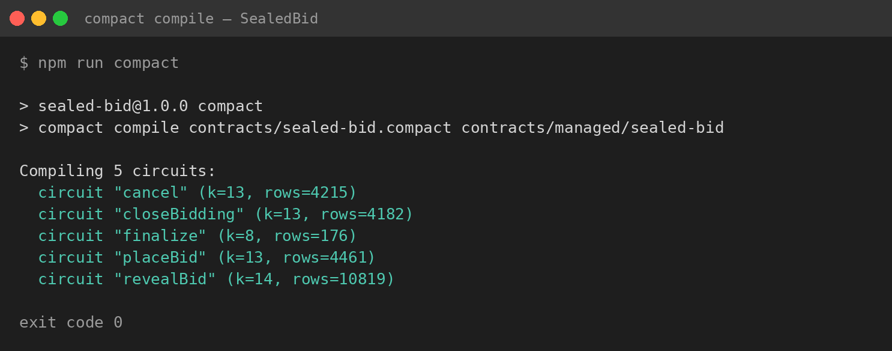
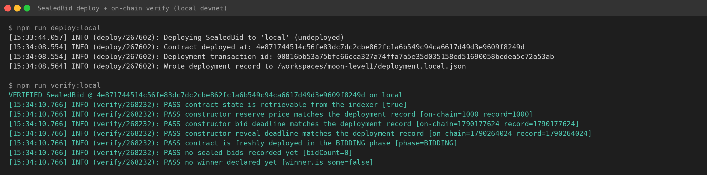

# SealedBid — sealed-bid auctions with private bids on Midnight

> **SealedBid** is a privacy-preserving sealed-bid (first-price) auction for the
> [Midnight network](https://midnight.network): every bidder publishes only a
> cryptographic commitment to their bid, the amounts stay zero-knowledge-private
> until the reveal phase, and only the winning amount ever becomes public.
> Losing amounts are never disclosed to anyone — not other bidders, not the
> auctioneer, not a chain observer.

Written in [Compact](https://docs.midnight.network/build/compact/syntax), the
zero-knowledge smart-contract language, and deployed with the official
`midnight-js` stack.

## The product idea

Procurement auctions, acquisition bids, and spectrum or asset sales all fail in
the same way on transparent ledgers: every bid is visible the moment it is
made, so rivals snipe at the last second, sellers push prices up with shill
bids, and bidders coordinate off-ledger. SealedBid is the missing primitive — a
drop-in sealed-bid auction where bidders learn nothing about each other's
offers until the window closes, the auctioneer cannot see (or fake) any bid
amount, and the outcome is computed by a zero-knowledge circuit that anyone can
audit. One deployment runs one auction: point it at a reserve price and a
schedule, collect commitments, open them, and settle — with every losing amount
kept private forever.

## Screenshots

Compilation with the official tooling — every circuit is compiled to real
zk-SNARK proving/verifying keys:



Deployment and independent on-chain verification:



## How it works

```
 BIDDING ──closeBidding (auctioneer)──▶ REVEAL ──finalize (anyone)──▶ FINALIZED
    │                                     │
    └──cancel (auctioneer, zero bids)─────┴──▶ CANCELLED
```

* **Bidding phase** — a bidder publishes only `H(domain, amount, nonce,
  bidderId)`. `amount` and the fresh `nonce` are private circuit inputs and are
  never written to the ledger.
* **Reveal phase** — the bidder opens the commitment; the circuit recomputes
  `H(domain, amount, nonce, bidderId)` and rejects a non-matching reveal.
  Opening becomes the new best bid only if it meets the reserve price.
* **Settlement** — `finalize` is deliberately permissionless: the outcome is a
  pure function of the revealed bids, so anyone can trigger it and no party can
  block it.

Identity is *knowledge of a 32-byte secret*: every on-chain identity is a
domain-separated hash of the secret derived inside a witness, and the secret
itself never leaves the prover. `ownPublicKey()` is deliberately **not** used
for authorisation because it is a prover-claimed value with no binding to the
transaction signer. The full threat model lives in [`docs/SECURITY.md`](docs/SECURITY.md).

### Circuits

| Circuit | Caller | Effect |
| --- | --- | --- |
| `constructor(reservePrice, bidDeadline, revealDeadline)` | deployer | Records the auctioneer pseudonym and schedule; enters `BIDDING` |
| `placeBid(sealedBid)` | anyone, once | Stores `commitment → bidderId`; one sealed bid per identity |
| `closeBidding()` | auctioneer | `BIDDING → REVEAL` |
| `revealBid(amount, nonce)` | committer | Opens the commitment; updates `highestBid` if it qualifies |
| `finalize()` | **anyone** | Declares `winner`/`winningAmount`; `REVEAL → FINALIZED` |
| `cancel()` | auctioneer, zero bids only | `BIDDING/REVEAL → CANCELLED` |

Key guarantees (all enforced by circuits and asserted by tests): bids are
sealed until revealed; a committed bid can never be cancelled away; every
identity may place exactly one sealed bid; a bid that never opens correctly
contributes nothing to the outcome; the reserve price is enforced
(`>=` wins, strictly-greater overtakes, ties keep the incumbent).

## Public state vs. private witness

A Compact contract splits reality into two worlds, and the security of SealedBid
depends on keeping the border between them exact.

**Public ledger state** (`export ledger ...` in `sealed-bid.compact`) is visible
to everyone forever — the indexer, every bidder, any observer:

| Public cell | Contents | Why it is safe to publish |
| --- | --- | --- |
| `phase` | `BIDDING / REVEAL / FINALIZED / CANCELLED` | Lifecycle progress, no bid data |
| `auctioneer`, `commitments`, `bidderCommitment` | Hash-derived pseudonyms, `H(domain, amount, nonce, bidderId)` commitments | One-way hashes; without `amount` and `nonce` a commitment cannot be checked or opened |
| `revealedCommitments` | Which commitments opened | Participation is inherently public at reveal |
| `highestBid`, `highestBidder`, `winningAmount`, `winner` | The outcome | An auction must declare a result — this is the only amount ever disclosed |
| `reservePrice`, `bidDeadline`, `revealDeadline`, counters | Auction terms | Public rules of the game |

**Private witness state** lives only in the prover's process (`witness localSecretKey()`
plus the per-call arguments `amount` and `nonce` in `revealBid`). Witnesses are
TypeScript functions run off-chain by the bidder themselves; the circuit consumes
their values to build a proof, and the proof — never the values — goes on-chain:

* `secretKey: Uint8Array` — the 32-byte secret each participant holds. Every
  on-chain identity is a domain-separated hash of it (`deriveBidderId`,
  `deriveAuctioneerId`), so the ledger never stores it and leaking the ledger
does not reveal it.
* `amount` — the bid value in `revealBid`. The circuit proves
  `H(domain, amount, nonce, bidderId)` equals the commitment registered during
  bidding, and discloses only two derived bits (`amount >= reservePrice`,
  `amount > highestBid`) plus the amount itself *only* when it becomes the new
  best bid. A losing amount never reaches any ledger cell — asserted by tests
  that serialise the entire raw ledger state and search it for the amounts.
* `nonce` — the fresh 32-byte blinding value that makes a commitment
  unguessable; without it, a suspected amount could be verified off-chain
  against a public commitment.

The rule the contract follows everywhere: **a value may be written to the
ledger only through `disclose(...)`, and every `disclose` is a deliberate
privacy decision** — pseudonyms, commitments, outcome bits, the winning bid —
never raw witnesses. The `src/test/sim/security.sim.test.ts` suite falsifies
this claim continuously: if any bid amount, secret key, or nonce were to leak
into the public state, those tests fail.

## Repository layout

```
contracts/
  sealed-bid.compact          # the contract source (Compact)
  managed/                    # GENERATED by `npm run compact` - do not edit
    sealed-bid/
      contract/               # generated JS + typings + sourcemap
      zkir/                   # zero-knowledge intermediate representation
      keys/                   # proving (.prover) and verifying (.verifier) keys
src/
  config.ts                   # network configuration and wallet-secret resolution
  env.ts                      # .env.<network> loader
  witnesses.ts                # private-state + witness implementations
  simulator.ts                # in-process driver for the real compiled circuits
  commitments.ts              # client-side commit/reveal helpers (pure circuits)
  wallet.ts / providers.ts / funding.ts
  deploy.ts / verify.ts       # deployment + independent verification libraries
  test/
    sim/                      # 79 in-process tests over the real circuits
    e2e/                      # end-to-end suite against a real network
scripts/
  install-compact.sh          # pinned Compact toolchain installer
  derive-address.ts           # print wallet addresses without syncing
  request-funds.ts            # faucet helper
  wait-for-dust.ts            # block until fee (DUST) is spendable
  deploy.ts / verify.ts       # CLI runners
  acceptance-audit.sh         # clean-room audit: npm run audit
docs/SECURITY.md              # threat model and design rationale
compose.yml                   # local devnet + proof server (Docker)
```

## Prerequisites

* **Node.js >= 22** and npm
* **Docker** — for the local devnet and the proof server (used for every
  network; proving always happens locally)
* The **Compact toolchain** — install the pinned version with:

```bash
./scripts/install-compact.sh        # installs `compact` 0.5.2 + compiler 0.31.1
```

The script downloads the manager from the official
[`midnightntwrk/compact`](https://github.com/midnightntwrk/compact/releases)
release, verifies its SHA-256 checksum, and installs the compiler. Verify:

```bash
compact --version   # compact 0.5.2
```

## Installation

```bash
git clone <this repository>
cd sealed-bid
npm ci                  # reproducible install from package-lock.json
./scripts/install-compact.sh
npm run compact         # generate contracts/managed/ (committed, but re-generatable)
```

## Compilation

```bash
npm run compact         # compact compile contracts/sealed-bid.compact contracts/managed/sealed-bid
```

This regenerates the **real** `contracts/managed/sealed-bid/` artifacts: the
generated contract JS + typings, one `.zkir` per circuit and one
`.prover`/`.verifier` key pair per circuit (proving keys are several MB of real
circuit data — there are no stub artifacts in this repository). `npm run ci`
runs typecheck + compile + the simulation suite.

## Testing

```bash
npm run test:sim        # 79 tests, in-process, no Docker needed
npm run test:e2e:local  # full auction against the local Docker devnet
```

The simulation suite runs the *actual compiled circuits* in-process (real
witnesses, real ledger semantics; only proof generation is skipped), so the
whole suite executes in seconds. Coverage includes: happy paths, the full
lifecycle, invalid constructor inputs, phase-ordering violations, double bids
and double reveals, wrong amounts/nonces, impersonation attempts, commitment
binding and non-transferability, cross-auction replay, privacy (the raw
serialised ledger state is scanned to prove losing amounts never appear, with
positive controls), anti-rug guarantees, shill resistance and permissionless
settlement.

The E2E suite deploys the contract and drives a real auction — commit, close,
reveal, finalize — with genuine zero-knowledge proofs and real on-chain state
reads. On a cold devnet run `npm run wait:dust` once before the E2E suite so
the fee resource exists.

## Deployment

Deployments are recorded in a `deployment.<network>.json` manifest containing
only public data (contract address, transaction id, deployer address,
constructor args). Wallet secrets are read from git-ignored `.env.<network>`
files — see the examples (`.env.preview.example`, `.env.preprod.example`);
never commit them.

```bash
cp .env.preview.example .env.preview    # then fill in MIDNIGHT_PREVIEW_SEED or _MNEMONIC
npm run deploy:preview                  # deploy + write deployment.preview.json
npm run verify:preview                  # independent re-verification via the indexer
```

`verify` deliberately uses a separate code path (`indexerPublicDataProvider`
only, no wallet) to re-read the contract state from the network indexer and
check it against the recorded manifest. The same flow works with `preprod` and
`local`.

### Funding notes (Preview / Preprod)

The wallet needs tNIGHT plus spendable DUST (the fee resource). Get tNIGHT from
the human faucet page (linked in the `.env.*.example` files); the deploy
scripts also attempt the programmatic drip endpoint. The faucet's public API is
Cloudflare-Turnstile-gated — a captcha solved in a browser — so programmatic
drips without a browser session are refused by design; use the faucet page and
paste the address printed by:

```bash
MIDNIGHT_NETWORK=preview npx vite-node scripts/derive-address.ts
```

The first wallet sync on a public network can take 10–20 minutes (the wallet
scans the whole zswap index); the deploy script waits for it.

## Deployed contract records

### Local devnet (deployed and verified)

Deployed with the repository's own tooling (`npm run deploy:local`) against the
local Docker devnet, then independently re-verified through a separate
indexer-only code path (`npm run verify:local`) — all seven checks `PASS`
(see the screenshot above).

| Field | Value |
| --- | --- |
| Network | `local` (network id `undeployed`) |
| Contract address | `4e871744514c56fe83dc7dc2cbe862fc1a6b549c94ca6617d49d3e9609f8249d` |
| Deploy transaction id | `00816bb53a75bfc66cca327a74ffa7a5e35d035158ed51690058bedea5c72a53ab` |
| Constructor args | `reservePrice=1000`, `bidDeadline=1790177624`, `revealDeadline=1790264024` |
| Compiler | `compact` 0.31.1, language version 0.23 |
| Verification | `npm run verify:local` — `VERIFIED`, state re-read from the devnet indexer |

`deployment.local.json` (git-ignored) holds the full record. Reproduce with:
`npm run env:up && npm run wait:dust && npm run deploy:local && npm run verify:local`.

### Preview testnet

A Preview deployment (`npm run deploy:preview`) is prepared: the deployer
wallet is configured, its address derived, and the full sync + drip + deploy +
verify workflow documented above. The wallet must first be topped up through
the captcha-gated human faucet (see *Funding notes*); the record is filled in
here once the deployment lands.

| Field | Value |
| --- | --- |
| Network | `preview` (network id `preview`) |
| Contract address | _pending faucet funding — see above_ |
| Verification | `npm run verify:preview` |

## Clean-room acceptance audit

```bash
npm run audit                   # toolchain, compile, artifacts, tests, secrets, docs
AUDIT_FULL=1 npm run audit      # + live devnet health, local deploy verify
```

The audit executes every requirement — compilation with the official tooling,
artifact genuineness checks (sizes, generated-code markers), the full test
suite, git-hygiene scans for secrets, documentation checks and, with
`AUDIT_FULL=1`, live on-chain verification — and exits non-zero on any failure.

## Troubleshooting

* **`compact: command not found`** — run `./scripts/install-compact.sh` and
  ensure `~/.local/bin` is on your `PATH`.
* **`checkRuntimeVersion` mismatch when running tests** — the generated
  `contracts/managed/` was produced by a different compiler than the
  `@midnight-ntwrk/compact-runtime` version pinned in `package.json`. Re-run
  `npm run compact` with the pinned toolchain (0.31.1).
* **Proof server errors mentioning `srs.midnight.network`** — the proof server
  downloads the structured reference string on first start. If your Docker
  bridge network blocks DNS/sibling traffic, use the host-network override
  (default on Linux): `npm run env:up`. On macOS/Windows use
  `npm run env:up:bridge`.
* **`Wallet.InsufficientFunds` on a fresh devnet** — run `npm run wait:dust`
  once; a synced wallet at block 0 has no spendable DUST coin yet.
* **First transaction on Preview/Preprod fails after funding** — the wallet
  must sync past the funding transaction; re-run the deploy, it resumes.
* **Faucet drip returns `Captcha verification failed`** — expected: the public
  drip API requires a browser-solved Turnstile token. Use the faucet page
  instead (address via `scripts/derive-address.ts`).
* **E2E tests time out on remote networks** — remote wallet sync can take
  10–20+ minutes; the vitest hook timeout is already raised for remote
  networks in `vitest.e2e.config.ts`.
* **Port conflicts** — the devnet binds `127.0.0.1:6300` (proof server),
  `:8088` (indexer) and `:9944` (node). Stop conflicting services or edit
  `compose.yml`.

## License

MIT — see [`LICENSE`](LICENSE).
